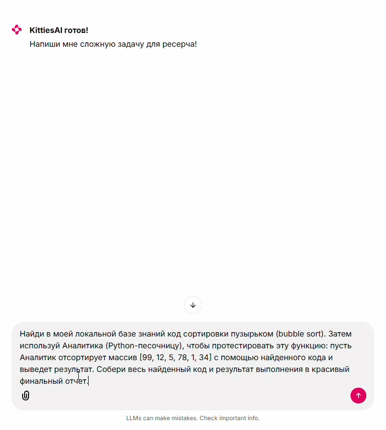

<p align="center">
  <span style="font-size:2.5rem; font-weight:700; vertical-align: middle;">
    KittiesAI
  </span>
</p>

<p align="center">
  
  
  
  
  
</p>

<p align="center">
  
  
  
  
  
</p>

<p align="center">
  
  
</p>

# About

**KittiesAI** — это продвинутая **Мульти-Агентная Система (Multi-Agent System)**, построенная на фреймворке `LangGraph`. Проект демонстрирует архитектуру распределения ролей (Separation of Concerns), где сложная задача разбивается на этапы и решается командой специализированных AI-агентов.

Система работает по принципу конвейера: от поиска сырых данных (в интернете или локальном коде) до их математической обработки в изолированной среде и финальной верстки красивого отчета.

### Команда агентов:
* **Supervisor:** мозг системы, анализирует интент юзера, отвечает на **smalltalk**, маршрутизирует задачи между агентами и следит за строгим соблюдением пайплайна с помощью встроенных **guardrails** (предохранителей от зацикливания).
* **Researcher:** специалист по поиску данных, умеет искать информацию в интернете(**Tavily API**), а так же фрагменты кода в локальной базе знаний (**RAG на Qdrant**).
* **Analyst:** программист, умеет писать **python**-скрипты для анализа данных и выполняет их в защищенной **docker**-песочнице.
* **Editor:** копирайтер, собирает сухие цифры и код от коллег и превращает их в идеально отформатированный **markdown**-отчет.

### Ключевые особенности проекта:
* **Strict Guardrails & State Management**: оркестратор защищен от бесконечных циклов и галлюцинаций (**supervisor** не может пропустить **analyst**, если нужен код, и не может завершить граф без финального отчета **editor**).
* **Hybrid RAG**: векторная БД (**Qdrant** + **FastEmbed** `multilingual-MiniLM`) позволяет **researcher** находить приватные алгоритмы в локальной кодовой базе, параллельно обращаясь к интернету.
* **Secure Sandbox Execution**: весь сгенерированный код автоматически тестируется и выполняется в изолированном **docker**-контейнере с ограничением по времени (**timeout**), памяти и без доступа к сети.
* **LLMOps Observability**: интеграция с **LangSmith** для пошагового трейсинга мыслей агентов, контроля потребления токенов и отладки графа в реальном времени.

---

# Hierarchy

```text
KittiesAI/
├── agents/                 # Промпты и логика AI-агентов
│   ├── analyst.py          # Агент-программист (Docker)
│   ├── editor.py           # Агент-копирайтер (Markdown)
│   ├── researcher.py       # Агент-поисковик (Web + RAG)
│   └── supervisor.py       # Оркестратор графа и роутер
├── core/                   # Ядро LangGraph
│   ├── graph.py            # Сборка узлов и связей (Edges)
│   └── state.py            # Типизация глобальной памяти (AgentState)
├── rag/                    # Скрипты для работы с документами
│   └── ingest.py           # Чанкинг (RecursiveCharacterTextSplitter) и загрузка в Qdrant
├── target_repo/            # Исходники для локальной базы знаний (RAG)
├── tools/                  # Инструменты агентов
│   ├── agent_tools.py      # Инициализация и @tool декораторы
│   ├── code_search.py      # Qdrant Client 
│   ├── sandbox.py          # Docker Client 
│   └── web_search.py       # Tavily Client 
├── .env                    # API ключи (Groq, Tavily, LangSmith)
├── cli.py                  # CLI интерфейс для 
├── config.py               # Инициализация LLM и переменных окружения
└──  ui.py                   # Интерфейс чата на Chainlit
```